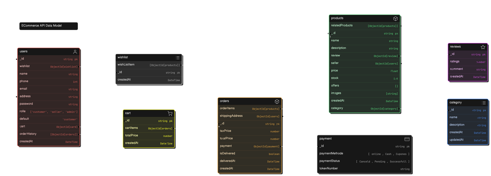

# 🛒 Scalable eCommerce API

[](https://github.com/yourusername/ecommerce-api)
[](https://github.com/yourusername/ecommerce-api/blob/main/LICENSE)
[](https://nodejs.org/)

Welcome to the **Scalable eCommerce API** — a highly efficient, production-ready API for managing online stores. Built with **Node.js** and **Express**, this API handles everything from user authentication to order processing, inventory management, and more. Whether you're running a small business or scaling to handle thousands of orders, this API is designed to meet your needs.

## 🚀 Live Demo

You can check out the live demo of the API hosted on [Heroku/AWS](https://your-deployed-link.com).

## 🏗️ Project Architecture

The API is built using the **Node.js** ecosystem with a focus on scalability and performance:

- **Backend**: Node.js with Express.js
- **Database**: MongoDB (with Mongoose ORM)
- **Caching**: Redis for fast caching and session management
- **Search**: Elasticsearch for full-text search on product data
- **Storage**: AWS S3 for managing product images
- **Authentication**: JSON Web Token (JWT)
- **Payments**: Stripe and PayPal integrations for handling secure payments

---

## 📋 Features

### 1. **User Authentication & Authorization**
- User registration, login, and password management.
- JWT-based authentication for secure access.
- Role-based access control (Admin, Seller, Customer).

### 2. **Product Management**
- Full CRUD for managing products and categories.
- Product variants (size, color, etc.).
- Image uploads using AWS S3.
- Inventory tracking and stock management.

### 3. **Shopping Cart & Checkout**
- Add/remove items to/from the cart.
- Apply discounts and calculate shipping and taxes.
- Secure checkout with Stripe or PayPal integration.
- Order tracking and invoicing.

### 4. **Order Management**
- Order history and tracking.
- Real-time notifications for order status updates.
- Generate PDF invoices for each completed order.

### 5. **Admin & Seller Dashboards**
- Admins can manage users, products, and view detailed reports.
- Sellers can manage their inventory and view their orders.

### 6. **Search & Filtering**
- Full-text search for products using Elasticsearch.
- Filter products by price, category, brand, and more.

### 7. **Analytics & Reports**
- Sales reports for Admin with insights into best-selling products, revenue, etc.
- Customer engagement tracking (abandoned carts, repeat customers).

---

## 🛠️ Tech Stack

| Tech                | Description                                   |
|---------------------|-----------------------------------------------|
| **Node.js**          | Event-driven JavaScript runtime for building fast APIs |
| **Express.js**       | Minimalist web framework for Node.js          |
| **MongoDB**          | NoSQL database used for product and user data |
| **Mongoose**         | MongoDB ORM for easier database interactions  |
| **Redis**            | Caching system to speed up responses          |
| **Elasticsearch**    | For fast, scalable full-text product search   |
| **JWT**              | Secure authentication using JSON Web Tokens   |
| **Stripe & PayPal**  | Payment gateway integrations                  |
| **AWS S3**           | Cloud storage for product images              |
| **Docker**           | Containerization of the application for easy deployment |

---

## 🛠️ Installation & Setup

To run the API locally, follow these steps:

### 1. Clone the Repository

```bash
git clone https://github.com/yourusername/ecommerce-api.git
cd ecommerce-api
```
### 2. Install Dependencies
Make sure you have Node.js installed. Then, install all the required dependencies:

```bash
npm install
```

### 3. Environment Variables
Create a .env file in the root of the project and configure the following variables:

```bash
PORT=5000
MONGO_URI=your_mongodb_connection_string
JWT_SECRET=your_jwt_secret_key
REDIS_URL=your_redis_url
STRIPE_API_KEY=your_stripe_api_key
PAYPAL_CLIENT_ID=your_paypal_client_id
AWS_ACCESS_KEY_ID=your_aws_access_key
AWS_SECRET_ACCESS_KEY=your_aws_secret_key
AWS_BUCKET_NAME=your_s3_bucket_name
```

### 4. Run the Server
Start the server in development mode using nodemon:

```bash
npm run dev
```
The API should now be running on http://localhost:5000.

## 💿 Data Model


## 📚 API Documentation
The full API documentation is available via Swagger at /api-docs once the server is running. You can also import the provided Postman collection to test the API.

## Key Endpoints

### Authentication
- ```POST /api/auth/register```: Register a new user.
- ```POST /api/auth/login```: Login with username and password.

### User Oprations
- ```GET /api/user/:id```: Get a user information.
- ```PATCH /api/:id```: Update a user information.
- ```DELETE /api/user/:id```: Delete the user.

### Product Management
- ```GET /api/products```: Get a list of all products.
- ```POST /api/products```: Add a new product (Admin/Seller only).
- ```PATCH /api/products/:id```: Update product details.
- ```DELETE /api/products/:id```: Delete a product (Admin/Seller only).

### Order Management
- ```POST /api/orders```: Create a new order.
- ```GET /api/orders/:id```: Get order details.

### Cart Management
- ```POST /api/cart```: Add items to the cart.
- ```DELETE /api/cart/:id```: Remove items from the cart.

## 🚀 Deployment
You can deploy this project to Heroku, AWS, or any cloud provider. Below is an example of deploying to Heroku:

### 1. Create a Heroku app:

```bash
heroku create
```

### 2. Push the code to Heroku:

```bash
git push heroku master
```
### 3. Set environment variables on Heroku using:

```bash
heroku config:set JWT_SECRET=your_jwt_secret_key
```

### 4. Your API should now be live on Heroku.

## 🧪 Testing
To run the tests for this project, use the following command:

```bash
npm test
```

Unit tests and integration tests cover the key 
functionalities of the API, ensuring stability and reliability.

## 📝 Contributing
We welcome contributions to make this project better! Please fork the repository and submit a pull request with improvements, bug fixes, or new features.

## 📄 License
This project is licensed under the MIT [License](). See the LICENSE file for details.

## 🙌 Acknowledgements
Node.js for providing a robust server-side environment.
MongoDB for scalable NoSQL database support.
Stripe & PayPal for easy payment integration.
Express.js for making API development fast and easy.
